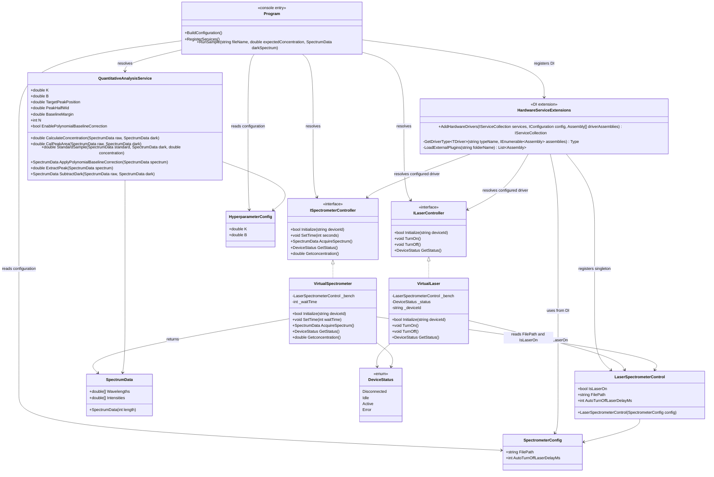

# 拉曼光谱定量分析系统设计与测试说明

## 1. 模块关系与接口设计

### 1.1 项目模块

```text
RamanSpectrometer.Solution
├─ application.json
├─ RamanSpectrometer.slnx
├─ SystemDesignAndTestReport.md
├─ data
│  ├─ calib_50mg.csv
│  ├─ calib_50mg1.csv
│  ├─ test_20mg.csv
│  ├─ test_20mg1.csv
│  ├─ test_80mg.csv
│  └─ test_80mg1.csv
├─ src
│  ├─ RamanSpectrometer.Core
│  │  ├─ Configurations
│  │  │  ├─ HyperparameterConfig.cs
│  │  │  └─ SpectrometerConfig.cs
│  │  ├─ control
│  │  │  └─ LaserSpectrometerControl.cs
│  │  ├─ Enums
│  │  │  └─ DeviceStatus.cs
│  │  ├─ factory
│  │  │  └─ HardwareServiceExtensions.cs
│  │  ├─ Interfaces
│  │  │  ├─ ILaserController.cs
│  │  │  └─ ISpectrometerController.cs
│  │  ├─ Models
│  │  │  └─ SpectrumData.cs
│  │  └─ RamanSpectrometer.Core.csproj
│  ├─ RamanSpectrometer.Hardware
│  │  ├─ Virtual
│  │  │  ├─ VirtualLaser.cs
│  │  │  └─ VirtualSpectrometer.cs
│  │  └─ RamanSpectrometer.Hardware.csproj
│  ├─ RamanSpectrometer.Services
│  │  ├─ Analysis
│  │  │  └─ QuantitativeAnalysisService.cs
│  │  └─ RamanSpectrometer.Services.csproj
│  └─ RamanSpectrometer.App
│     ├─ Program.cs
│     └─ RamanSpectrometer.App.csproj
└─ tests
   └─ RamanSpectrometer.Tests
      ├─ RamanSpectrometer.Tests.csproj
      └─ SystemIntegrationTest.cs
```

### 1.2 类图 / 模块关系图


### 1.3 接口设计说明

#### `ILaserController`

用于抽象激光器控制能力：

- `Initialize`：初始化连接。
- `SetPower`：设置激光功率。
- `TurnOn`：打开激光。
- `TurnOff`：关闭激光。
- `GetStatus`：获取激光器状态。

#### `ISpectrometerController`

用于抽象光谱仪控制能力：

- `Initialize`：初始化光谱仪。
- `SetTime`：设置积分时间。
- `AcquireSpectrum`：采集光谱数据。
- `GetStatus`：获取光谱仪状态。

#### `LaserSpectrometerControl`

用于虚拟硬件联动：

- `IsLaserOn`：标记激光器是否开启。
- `FilePath`：当前光谱仪采集的样品 CSV 文件路径。
- `AutoTurnOffLaserDelayMs`：自动关闭激光器延迟配置。

虚拟光谱仪会根据 `IsLaserOn` 决定：

- 激光关闭：生成暗光谱。
- 激光开启：从 `FilePath` 指定的 CSV 文件读取样品光谱。

---

## 2. 浓度计算算法原理与实现步骤

### 2.1 标准曲线模型

系统使用线性标准曲线反推浓度：

\[
c = k \cdot I + b
\]

其中：

- \(c\)：浓度，单位 mg/L。
- \(I\)：目标特征峰的峰面积。
- \(k\)：标准曲线斜率，对应 `HyperparameterConfig.K`。
- \(b\)：标准曲线截距，对应 `HyperparameterConfig.B`。

配置文件示例：

```json
{
  "HyperparameterConfig": {
    "K": 0.012224,
    "B": 0
  }
}
```

### 2.2 算法处理流程

主入口：

```text
QuantitativeAnalysisService.CalculateConcentration(raw, dark)
```

完整流程：

```text
原始光谱 raw
  ↓
扣除暗光谱 SubtractDark(raw, dark)
  ↓
多项式基线校正 ApplyPolynomialBaselineCorrection(cleanSpectrum)
  ↓
特征峰窗口积分 ExtractPeak(baseSpectrum)
  ↓
浓度反推 c = K × peakArea + B
```

### 2.3 预处理方法

#### 2.3.1 暗光谱扣除

暗光谱用于模拟传感器暗电流、固定热噪声等背景信号。

实现方式：

\[
I_{clean}(x) = \max(0, I_{raw}(x) - I_{dark}(x))
\]

代码对应：

```text
QuantitativeAnalysisService.SubtractDark(raw, dark)
```

#### 2.3.2 多项式基线校正

拉曼光谱常包含荧光背景、缓慢漂移基线等。系统使用多项式拟合全局基线，并从光谱中扣除。

处理步骤：

1. 根据目标峰位置排除主峰附近区域，避免主峰参与基线拟合。
2. 将横坐标归一化到 \([-1, 1]\)，提升多项式拟合数值稳定性。
3. 使用 `MathNet.Numerics.Fit.Polynomial` 拟合多项式基线。
4. 对每个点计算基线值并扣除。

公式：

\[
I_{baselineCorrected}(x) = \max(0, I_{clean}(x) - P_n(x))
\]

其中 \(P_n(x)\) 是 n 阶多项式基线。

相关参数：

- `PeakPos`：目标峰位置，默认 1000 cm⁻¹。
- `PeakHalfWid`：峰积分半宽，默认 30。
- `Baseline`：基线拟合排除区域额外边界，默认 15。
- `N`：多项式阶数，默认 2。

#### 2.3.3 特征峰面积提取

在目标峰窗口内使用梯形积分计算峰面积。

积分窗口：

\[
[PeakPos - PeakHalfWid, PeakPos + PeakHalfWid]
\]

默认即：

```text
970 ~ 1030 cm⁻¹
```

梯形积分：

\[
Area = \sum_i \frac{y_i + y_{i+1}}{2} \cdot (x_{i+1} - x_i)
\]

代码对应：

```text
QuantitativeAnalysisService.ExtractPeak(spectrum)
```

### 2.4 浓度计算

得到峰面积后：

$ c = K \cdot Area + B $

代码对应：

```text
QuantitativeAnalysisService.CalculateConcentration(raw, dark)
```

---

## 3. 扩展性设计说明

### 3.1 如何添加新激光器硬件

当前系统通过 `ILaserController` 接口和 `HardwareServiceExtensions` 工厂完成激光器驱动装配。添加新激光器硬件有两种方式。

#### 方法一：在项目中实现接口后重新编译

在项目中新增一个类，实现 `ILaserController`：

```csharp
public class RealLaserController : ILaserController
{
    public bool Initialize(string deviceId) { ... }
    public void TurnOn() { ... }
    public void TurnOff() { ... }
    public DeviceStatus GetStatus() { ... }
}
```

然后将该类所在项目作为主程序可引用的程序集，并修改 `application.json`：

```json
{
  "HardwareConfig": {
    "LaserType": "RealLaserController",
    "SpectrometerType": "VirtualSpectrometer",
    "PluginPath": "drivers"
  }
}
```

程序启动时会通过 DI 工厂按 `LaserType` 查找并注册该激光器驱动。

#### 方法二：上传外部 DLL 插件后修改配置文件

如果新激光器驱动不想直接编译进主项目，可以单独创建类库项目，引用 `RamanSpectrometer.Core`，实现 `ILaserController`：

```csharp
public class PluginLaserController : ILaserController
{
    public bool Initialize(string deviceId) { ... }
    public void TurnOn() { ... }
    public void TurnOff() { ... }
    public DeviceStatus GetStatus() { ... }
}
```

编译后将生成的 DLL 上传或复制到配置指定的插件目录，例如：

```text
src/RamanSpectrometer.App/bin/Debug/net10.0/drivers/PluginLaser.dll
```

然后修改 `application.json`：

```json
{
  "HardwareConfig": {
    "LaserType": "PluginLaserController",
    "SpectrometerType": "VirtualSpectrometer",
    "PluginPath": "drivers"
  }
}
```

如果类名可能重复，也可以将 `LaserType` 写成完整类型名：

```json
{
  "HardwareConfig": {
    "LaserType": "PluginNamespace.PluginLaserController"
  }
}
```

业务层不需要修改，因为主程序始终依赖 `ILaserController` 接口。
测试文件为：PluginLaser.dll
测试文件内容：
```csharp
namespace RamanSpectrometer.Hardware.Virtual;

using RamanSpectrometer.Core.Control;
using RamanSpectrometer.Core.Enums;
using RamanSpectrometer.Core.Interfaces;
using RamanSpectrometer.Core.Models;

class TestSpectrometer(LaserSpectrometerControl bench) : ISpectrometerController
{
                //等待时间
    private int _waitTime = 100;
    private readonly LaserSpectrometerControl _bench = bench;

                public bool Initialize(string deviceId) => true;

    public void SetTime(int waitTime)
    {
        if (waitTime <= 0)
        {
            throw new ArgumentOutOfRangeException(nameof(waitTime), "Integration time must be greater than zero.");
        }

        _waitTime = waitTime;
    }

    public SpectrumData AcquireSpectrum()
    {
        //模拟等待时间
        Thread.Sleep(_waitTime);

        //控制逻辑：如果打开了激光器则读取相应原始光谱文件，否则生成暗光谱
        return _bench.IsLaserOn
            ? LoadFile(_bench.FilePath)
            : GenerateDarkNoiseSpectrum();
    }

    public double Getconcentration()
    {
        return 26.0;
    }

    public DeviceStatus GetStatus() => DeviceStatus.Idle;

    /// <summary>
    /// 生成暗光谱
    /// </summary>
    /// <returns>data</returns>
    private static SpectrumData GenerateDarkNoiseSpectrum()
    {
        const int dataLength = 1024;
        var data = new SpectrumData(dataLength);
        var random = new Random();

        for (var i = 0; i < dataLength; i++)
        {
            data.Wavelengths[i] = 500 + i * (1000.0 / (dataLength - 1));
            data.Intensities[i] = random.NextDouble() * 5.0;
        }

        return data;
    }

    private static SpectrumData LoadFile(string filePath)
    {
        if (!File.Exists(filePath))
        {
            throw new FileNotFoundException($"找不到文件: {filePath}", filePath);
        }

        var lines = File.ReadAllLines(filePath);
        var data = new SpectrumData(lines.Length);

        for (var i = 0; i < lines.Length; i++)
        {
            var parts = lines[i].Split(',');
            if (parts.Length >= 2 && double.TryParse(parts[0], out var x) && double.TryParse(parts[1], out var y))
            {
                data.Wavelengths[i] = x;
                data.Intensities[i] = y;
            }
        }

        return data;
    }
}
```
其中Getconcentration函数返回值写死为：26.0用于做区分。

### 3.2 如何添加新光谱仪硬件

新增光谱仪硬件的方式与激光器一致，也支持两种方式：

1. 在项目中实现 `ISpectrometerController` 后重新编译。
2. 将实现了 `ISpectrometerController` 的外部 DLL 放入 `HardwareConfig:PluginPath` 指定目录后修改配置。

接口示例：

```csharp
public class RealSpectrometerController : ISpectrometerController
{
    public bool Initialize(string deviceId) { ... }
    public void SetTime(int seconds) { ... }
    public SpectrumData AcquireSpectrum() { ... }
    public DeviceStatus GetStatus() { ... }
    public double Getconcentration() { ... }
}
```

配置示例：

```json
{
  "HardwareConfig": {
    "LaserType": "VirtualLaser",
    "SpectrometerType": "RealSpectrometerController",
    "PluginPath": "drivers"
  }
}
```

只要返回统一的 `SpectrumData`，后续分析算法无需变化。

### 3.3 如何修改浓度计算参数

修改 `application.json` 中的 `HyperparameterConfig`：

```json
{
  "HyperparameterConfig": {
    "K": 0.012224,
    "B": 0,
    "PeakPos": 1000.0,
    "PeakHalfWid": 30.0,
    "Baseline": 15.0,
    "N": 2,
    "EnablePolynomial": true
  }
}
```

其中：

- `K`：标准曲线斜率。
- `B`：标准曲线截距。
- `PeakPos`：目标峰位置。
- `PeakHalfWid`：峰积分窗口半宽。
- `Baseline`：基线拟合时排除主峰区域的额外边界。
- `N`：多项式基线拟合阶数。
- `EnablePolynomial`：是否启用多项式基线校正。

程序启动时读取配置：

```text
HyperparameterConfig -> QuantitativeAnalysisService
```

### 3.4 如何修改样品文件路径

修改 `application.json` 中的 `SpectrometerConfig`：

```json
{
  "SpectrometerConfig": {
    "FilePath": "E:\\project\\Solution\\RamanSpectrometer.Solution\\data\\calib_50mg.csv",
    "concentration": 50.0
  }
}
```

或者在运行时修改：

```csharp
bench.FilePath = "data/test_20mg.csv";
```

---
## 4. 控制台模拟流程

主程序位于：

```text
src/RamanSpectrometer.App/Program.cs
```

模拟流程：

```text
1. 读取 application.json 配置。
2. 初始化虚拟激光器和虚拟光谱仪。
3. 关闭激光器，采集暗光谱。
4. 打开激光器，读取 test_20mg.csv。
5. 计算峰面积、浓度和误差。
6. 关闭激光器。
7. 打开激光器，读取 test_80mg.csv。
8. 计算峰面积、浓度和误差。
9. 关闭激光器，结束流程。
```

运行命令：

```bash
dotnet run --project "e:\project\Solution\RamanSpectrometer.Solution\src\RamanSpectrometer.App\RamanSpectrometer.App.csproj"
```

---

## 5. 测试结果

### 5.1 测试环境

使用配置：

```text
K = 0.012224
B = 0
```

测试数据：

```text
data/test_20mg.csv
data/test_80mg.csv
```

### 5.2 控制台输出结果

```text
拉曼光谱定量分析系统 - 控制台模拟
====================================
配置参数: K=0.012224, B=0.000000

[1] 初始化虚拟硬件
激光器初始化: True
激光器状态: Idle
光谱仪状态: Idle

[2] 关闭激光器，采集暗光谱
光谱仪初始化: True
激光器状态: Idle
暗光谱点数: 1024

[3] 打开激光器，采集并计算样品浓度
样品文件: data/test_20mg.csv
激光器状态: Active
峰面积: 1730.17
计算浓度: 21.15 mg/L
真实浓度: 20.00 mg/L
绝对误差: 1.15 mg/L，相对误差: 5.75%
激光器状态: Idle

样品文件: data/test_80mg.csv
激光器状态: Active
峰面积: 6472.64
计算浓度: 79.12 mg/L
真实浓度: 80.00 mg/L
绝对误差: 0.88 mg/L，相对误差: 1.10%
激光器状态: Idle

[4] 关闭激光器，模拟流程结束
激光器状态: Idle
```

### 5.3 结果对比

| 样品 | 真实浓度 mg/L | 计算浓度 mg/L | 绝对误差 mg/L | 相对误差 |
|---|---:|---:|---:|---:|
| test_20mg.csv | 20.00 | 21.15 | 1.15 | 5.75% |
| test_80mg.csv | 80.00 | 79.12 | 0.88 | 1.10% |

### 5.4 误差评估

- `test_20mg.csv` 的相对误差为 5.75%，低浓度样品更容易受噪声和基线校正误差影响。
- `test_80mg.csv` 的相对误差为 1.10%，说明在较高浓度下目标峰面积更稳定。
- 当前误差水平说明系统流程可用，但若要提升低浓度样品精度，建议：
  - 使用多点标定拟合 K 和 B。
  - 增加空白样品扣除固定背景。
  - 调整 `PeakHalfWid` 和多项式阶数 `N`。
  - 对随机噪声增加平滑滤波处理。

---


